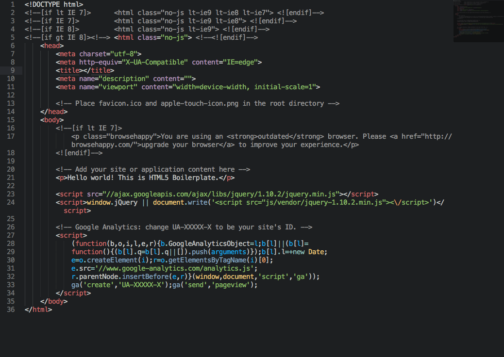
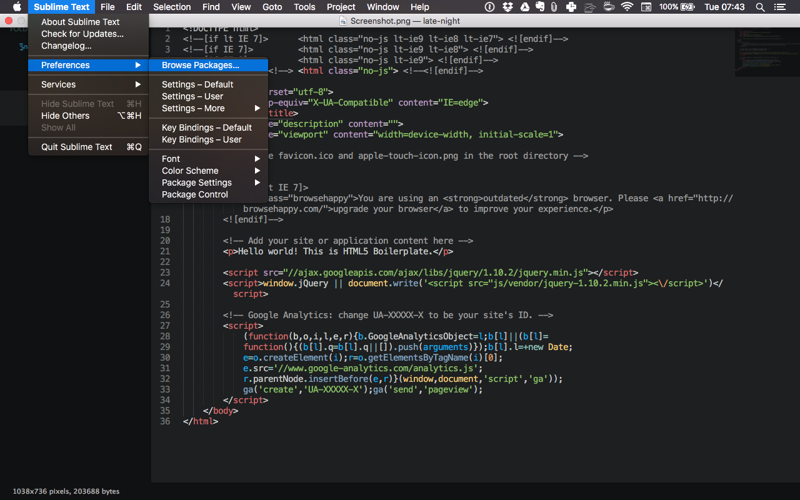
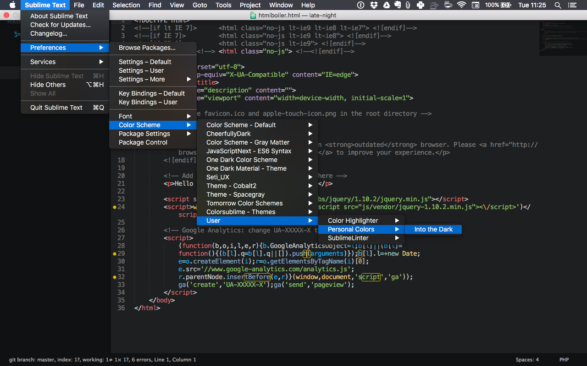

# "Into the Dark" Color Scheme for Sublime Text

This is the color scheme I personally use. It's the "Tomorrow Night" scheme with some tweaks.

## Instalation

1. Open Sublime Text and click on `Preferences > Browse Packages...`

2. Once the **"Packages"** folder pops open, look for the folder called **"User"**. If for any reason it doesn't exist, create it.

3. Create a new folder inside of **"User"** and name it something like **"Personal Colors"**.

4. Now put the file *"Into the Dark.tmTheme"* inside the **"Personal Colors"** folder.

5. You're all set. You can now select this theme by browsing `Preferences > Color Scheme > User > Personal Colors > Into the Dark`.
